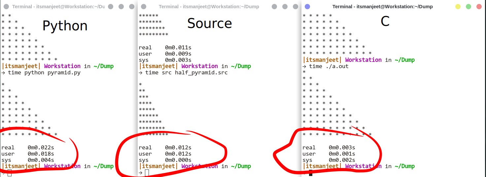

# [WIP] Source - a scripting language
Source is my hobby project to develop a simple yet efficient programming language with c like syntax and python like easiness


## Speed Comparison
speed comparison between python, source and c (i know c is compiled language, but i like that)  




# To Build
- ## In Linux
    - ### Needed
        - g++
        - flex
        - bison
        - libr    (# must if releax os)
        - project (# for build if releax os)

    - Execute make.sh
    - ``` $ bash make.sh ```
    - ``` $ ./build/sh ```
    - ``` $ project build source ```
    - ``` $ project build syscall ```


# To start

``` $ ./build/source ```

or

``` $ ./build/source test/01_hello.src ```


## Syntax

### assign
```
let a := 5;             /* integer   */
let b := 5.0;           /* float     */
let c := true           /* bool      */
let d := func arg { }   /* func      */
let e := cont { }       /* container */

```

### conditions
```

if a > 5 {
    print ("a is greater than 5");
} else {
    print ("a is smaller than 5");
}

```

### loops

```
for true {
    print("i am infinite");
    sleep(1);
}


for i in range(5) {
    print(i);
}

for let i := 5; i <= 20; i := i + 1 {
    print(i);
}

```

### functions

```
let f := func a1, a2 {
    let x := 4;
    ret := a1 * a2 + 4;
}

let return_value := f(5, 2);


```

### container ( as the name suggest )
```
let c := cont {
    a : 10,
    b : 10.5,
    x : true,
    d : "hello World",
    
    e : func a1, a2 {
        ret := a1 + a2 + b;
        }
};

print("c is ",c);

print("c -> a ", c->a);
print("c -> b ", c->b);
print("c -> x ", c->x);
print("c -> d ", c->d);
print("c -> e(2+5) ", c->e(2,5));
print("c -> f ", c->f);
print("a ", a);

```

### Modules
```
use io;

io.Println("Hello World");
```

```
use syscall;

syscall.write(1, "Hello World\n");
```
